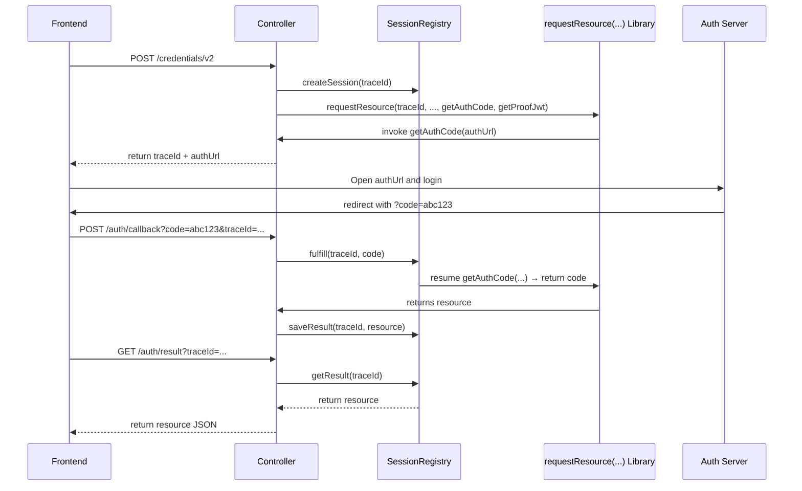

## Communication for VC download happening via VCI client library.

```mermaid
sequenceDiagram
    participant FE as Frontend
    participant Controller
    participant Registry as SessionRegistry
    participant Lib as requestResource(...) Library

    FE->>Controller: POST /credentials/v2
    Controller->>Registry: createSession(traceId)
    Controller->>Lib: requestResource(traceId, ..., getAuthCode, getProofJwt)
    Lib->>Controller: invoke getAuthCode(authUrl)
    Controller-->>FE: return traceId + authUrl

    FE->>Auth Server: Open authUrl and login
    Auth Server->>FE: redirect with ?code=abc123
    FE->>Controller: POST /auth/callback?code=abc123&traceId=...
    Controller->>Registry: fulfill(traceId, code)
    Registry->>Lib: resume getAuthCode(...) → return code

    Lib->>Controller: returns resource
    Controller->>Registry: saveResult(traceId, resource)

    FE->>Controller: GET /auth/result?traceId=...
    Controller->>Registry: getResult(traceId)
    Registry-->>Controller: return resource
    Controller-->>FE: return resource JSON
```