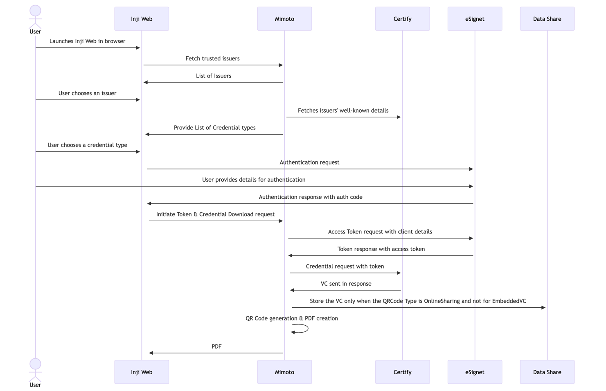

# **Understanding the workflow**

### **Inji Web IssuersPage**

- The users navigate to the Inji Web portal from their web browser.
- The portal features a user-friendly interface accessible to all.
- Inji Web Display the list of Issuers supported and sourced from [mimoto-issuers-configuration](https://github.com/mosip/mosip-config/blob/collab1/mimoto-issuers-config.json)

### **Selection of Issuer and credential type:**

- The users can select an Issuer from the list of trusted issuers
- On Clicking the issuer, user will be redirected to credential Types, where user will be displayed with list of credentials supported by the selected issuer.
- Credential Types of the issuers are sourced from the issuers wellknown **"/.well-known/openid-credential-issuer"**
- The users can choose a credential type from the available options provided by the issuers.

**Sequence Diagram for the Inji Web is mentioned here**

### **Authorization**

- When the user selects any credential type, user is redirected to the authorization page for that specific issuer.
- Once authorization is successful, authorization server return the **"authorizationCode"**
- Inji Web Send the authorization Code to authorization Server through Mimoto to perform the client assertions.
- Once Authorized, Authorization Server issues Token response, which include **access_token**.
- The "access_token" will be used to download the credential through VCI.

### **VC Issuance**

- Inji Web Send the access token to Mimoto.
- Mimoto generates a keypair and signs the credential Request and invokes the VCI endpoint to the issuer's server.
- Then Mimoto Gets the credential back.

### **PDF Download**

- Mimoto uses the download credential data on the [VC PDF template](https://github.com/mosip/mosip-config/blob/collab1/credential-template.html)
- It also applies the issuers wellknown display properties to modify the template text and background colour.
- It also uses order field in wellknown to render the fields in the same order.

### **Supported QR Codes**

- Mimoto Currently Supports Two Different QR Codes
  - EmbeddedVC -> uses Pixel pass library to embed the complete VC within the QR
  - OnlineSharing -> QR Contains a authorize endpoint, which validates the VP and redirects the VP token to the caller.
- Mimoto can toggle the issuers QR using the QR Code Type in the [mimoto-issuers-config.json](https://github.com/mosip/inji-config/blob/31704e5a31775551f535f74b3f9baad587468b79/mimoto-issuers-config.json#L105)
- Mimoto authorizes the verifiers using [mimoto-trusted-verifiers.json](https://github.com/mosip/inji-config/blob/release-0.3.x/mimoto-trusted-verifiers.json) as the source of truth

### **Online Sharing**

- Mimoto now has the ability for Share the credential online.
- Mimoto Stores the Credentials in the Datashare Service, and uses the resource link the QR Code along with the VP request. 
- When Verifier Scans the OVPRequest QR, The verifier is taken to mimoto through injiweb and performs the authorization using the mimoto-trusted-verifiers.json.
- Then redirects the VP token to the verifier through 302 Redirect. 
