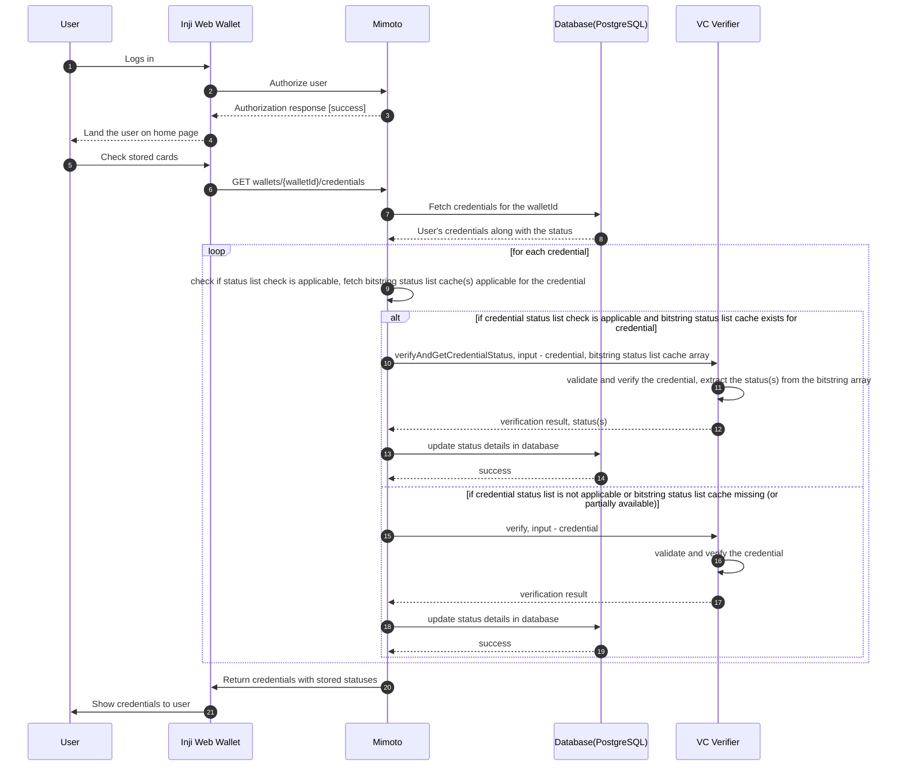
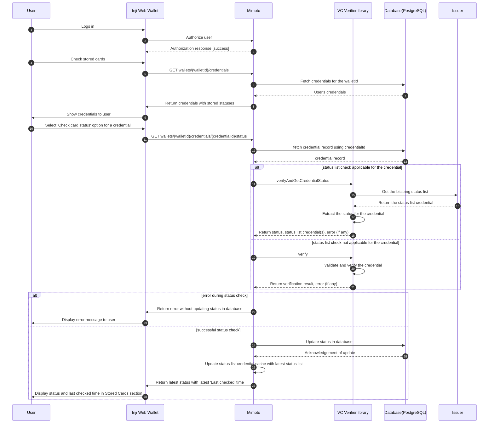
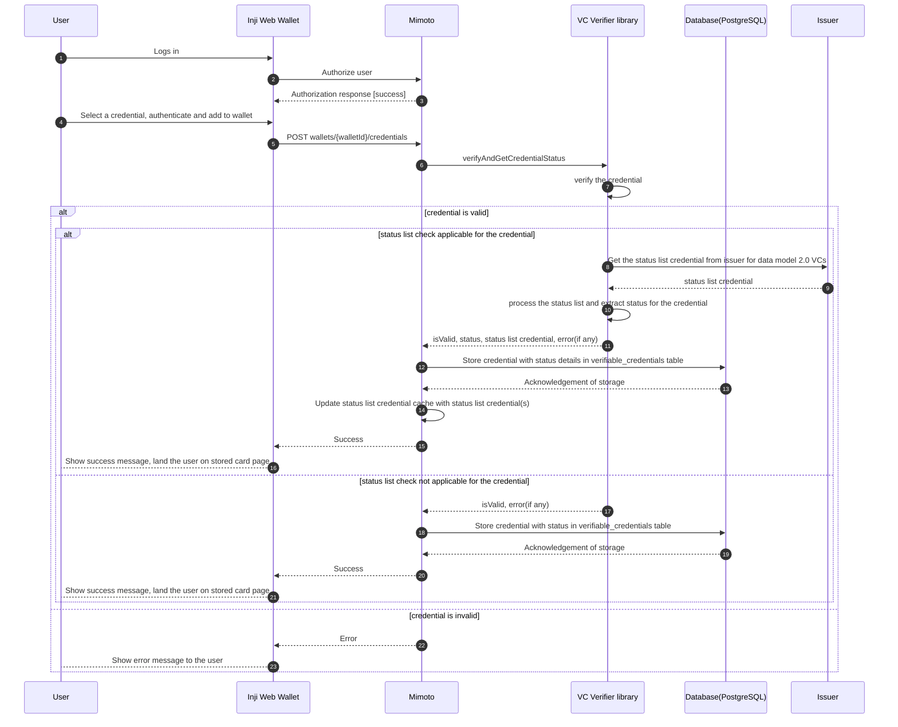

# Verifiable Credentials Status check

This design document outlines the approach for implementing status checks for Verifiable Credentials (VCs) within our system. The goal is to ensure that the status of a VC can be verified efficiently and securely, allowing relying parties to determine whether a credential is valid, revoked, or suspended.

### Overview

W3C Data model 2.0 supports status checking for Verifiable Credentials through the use of a `credentialStatus` property. This property points to a status list that can be queried to determine the current status of the credential.

### High level user flow

#### Flow : User lands on Inji Web application and views stored VCs with their status

- The user logs in and opens the Stored Cards page.
- For each credential in the wallet, mimoto will check the status using the VC verifier library. 
- For the W3C Data model 2.0 VCs, Mimoto resolves the status list credential cache entries referenced by the credential and passes them to the library. If any required entry is missing, Mimoto skips the status list check for that credential and invokes plain `verify` instead.
- The status returned by the library will be stored in the database and shown to the user alongside each credential. The last checked time will be updated to the time at which status list cache was created - if there are multiple list involved then minimum time will be updated in the database. 
- If there are multiple status list credentials involved for a VC, all the status list should be available in the cache for status list check to be performed. If any one of them is missing, status list check will be skipped for that VC.
- For credentials that were added before migrating to the latest application, their status will be set to valid by default using a database migration script.
- The status will be returned as an array. Mimoto will return all applicable status purposes for a credential as-is, without any transformation. Converting these into user-friendly labels will be handled by Inji Web.
- If status list is not applicable for a credential, only schema validation and signature verification results will be returned based on the validity period of the credential. The last checked time will be updated to current time for the credentials in this case.
- Mimoto determines cache completeness by reading the `credentialStatus` object of the credential, which it must parse in any case to derive the cache keys. The library remains responsible for determining status list applicability from the credential type and data model version once it has been invoked.

Sequence Diagram:



#### Flow : User clicks on 'Check card status' option for a credential
- The user selects the 'Check card status' option for a specific credential in their wallet.
- Mimoto invokes the VC Verifier library to check the status of the credential. Finally updates the status details in the database.
- Mimoto updates the status list cache too with the latest status list credential received from the issuer.
- Last checked time is updated to the current time for the credential.

Sequence Diagram:



#### Flow 3 : User adds a credential to wallet

- User logs in to Inji Web application
- Selects and adds a new verifiable credential to their wallet
- During the addition process, the system performs an immediate status check for the newly added credential using the VC Verifier library
- The system updates the status of the credential in the database based on the result of the status check and caches the status list
- The user is notified of the successful addition of the credential along with its current status
- The newly added credential is now available in the user's wallet with its status displayed
- If any error during status check, the user is notified with an error message and the credential is not added to the wallet.

Sequence Diagram:



### API Contract

#### Fetch All Credentials with Status

`GET wallets/{walletId}/credentials`

**Description**: Retrieves all verifiable credentials stored in a specific wallet along with their current status.

**Path Parameters**:
- `walletId` (string, required): Unique identifier of the wallet

**Response**:

Four new fields to be added in the response payload:
- `isSchemaAndSignatureValid` (boolean): Indicates if the schema and signature validation passed
- `isExpired` (boolean, nullable): Indicates if the credential has expired. `null` when expiry has not yet been determined for the credential — this applies to credentials added before this feature was introduced, until their first status check populates the field. Inji Web should render no expiry indicator for the `null` state rather than treating it as either expired or valid.
- `statusChecks` (array): Array of status purposes and their validity
  - Each object in the array contains:
    - `purpose` (string): The purpose of the status check (e.g., revocation, suspension)
    - `valid` (boolean): Indicates if the credential is valid for that purpose. `true` means valid, `false` means invalid i.e. revoked, suspended, etc.
- `lastCheckedAt` (string, ISO 8601 format): Timestamp of the last status check performed for the credential

**Success (200 OK)**:
```json
[
  {
    "issuerDisplayName": "Mosip",
    "issuerLogo": "https://example.com/logo.png",
    "credentialTypeDisplayName": "National Identity Department Mosip",
    "credentialTypeLogo": "https://example.com/credential-logo.png",
    "credentialId": "1234567890",
    "isSchemaAndSignatureValid": true,
    "isExpired": false,
    "statusChecks": [
      {"purpose": "revocation", "valid":true },
      {"purpose": "suspension", "valid":true }
    ],
    "lastCheckedAt": "2025-12-11T10:30:00Z"
  }
]
```

#### Check Credential Status

**Endpoint**: `GET /wallets/{walletId}/credentials/{credentialId}/status`

**Description**: Retrieves the current status of a specific credential from the issuer.

**Path Parameters**:
- `walletId` (string, required): Unique identifier of the wallet
- `credentialId` (string, required): Unique identifier of the credential

**Response**:

**Success (200 OK)**:
```json
{
  "credentialId": "string",
  "isSchemaAndSignatureValid": true,
  "isExpired": false,
  "statusChecks": [
    {"purpose": "revocation", "valid":true },
    {"purpose": "suspension", "valid":true }
  ],  
  "lastCheckedAt": "2025-12-11T10:30:00Z",
  "message": "string (optional)"
}
```

**Response Fields**:
- `credentialId`: The unique identifier of the credential
- `isSchemaAndSignatureValid`: Boolean indicating if the schema and signature validation passed
- `isExpired`: Boolean indicating if the credential has expired. Nullable — `null` when expiry has not yet been determined (see the `Fetch All Credentials with Status` response for details)
- `statusChecks`: Array of status purposes and their validity
- Each object in the array contains:
  - `purpose`: The purpose of the status check (e.g., revocation, suspension)
  - `valid`: Boolean indicating if the credential is valid for that purpose. `true` means valid, `false` means invalid i.e. revoked, suspended, etc.
- `lastCheckedAt`: Timestamp of the most recent status check
- `message`: Optional message providing additional context, especially in case of error

**Error Responses**:

- **404 Not Found**: Credential or wallet not found
```json
{
  "errorCode": "CREDENTIAL_NOT_FOUND",
  "message": "Credential with ID {credentialId} not found for wallet {walletId}"
}
```

- **400 Bad Request**: Invalid request parameters
```json
{
  "errorCode": "INVALID_REQUEST",
  "message": "Invalid walletId or credentialId format"
}
```

- **424 Failed Dependency**: Dependency service error
```json
{
  "errorCode": "STATUS_CHECK_FAILED",
  "message": "Failed to check credential status due to dependency service error"
}
```

- **500 Internal Server Error**: Unexpected error during status check
```json
{
  "errorCode": "INTERNAL_SERVER_ERROR",
  "message": "An unexpected error occurred while checking credential status"
}
```

**Behavior Notes**:
- For this endpoint, the `lastCheckedAt` timestamp reflects when the status was actually last verified with the issuer, since this flow always fetches the status list credential(s) afresh. This differs from the `Fetch All Credentials with Status` flow, where `lastCheckedAt` reflects the time the cached status list was fetched (the earliest such time when multiple status lists are involved)
- In case of any error during status check, the existing status in the database remains unchanged
- The status list credential cache is updated only on successful status checks

### Database Schema

#### verifiable_credentials Table

This table stores the verifiable credentials along with their status information. Four columns to be introduced for status tracking : 

| Column Name               | Data Type | Nullable? | Description                                                                                                                                                                                                       |
|---------------------------|-----------|-----------|-------------------------------------------------------------------------------------------------------------------------------------------------------------------------------------------------------------------|
| is_expired                | BOOLEAN   | Yes       | Indicates if the credentials has expired or not. Will be NULL for migrated credential where expired status is not known.                                                                                          |
| is_schema_signature_valid | BOOLEAN   | No        | If signature and schema validation has passed successfully.                                                                                                                                                       |
| status_checks             | JSONB     | Yes       | Current status purpose array for the credential derived from status list credential (e.g., revocation, suspension) . E.g. `[ {"purpose": "revocation", "valid":true }, {"purpose": "suspension", "valid":true }]` |
| status_last_checked_at    | TIMESTAMP | No        | Timestamp of the last status check performed                                                                                                                                                                      |

### Migration of existing credentials

A one-time migration script will be executed to initialize the `is_schema_signature_valid` and `status_last_checked_at` fields for existing credentials in the `verifiable_credentials` table. The script will set the `is_schema_signature_valid` value to true and the `status_last_checked_at` to the current timestamp. `is_expired` is deliberately left NULL rather than defaulted, since expiry cannot be reliably derived in SQL — the `credential` column may hold JWT, SD-JWT or mdoc payloads as well as JSON-LD. The field is populated the first time a status check runs for the credential, and is surfaced as `null` until then.

Following the existing repository convention, the migration will be delivered as a paired upgrade and rollback script under `db_upgrade_script/inji_mimoto/sql/` (the next version increment after `0.21.0_to_0.22.0`), alongside the corresponding DDL update in `db_scripts/inji_mimoto/ddl/mimoto-verifiable_credentials.sql`.


### Caching Strategy

To optimize performance and reduce redundant network calls to issuers for status checks, a caching mechanism will be implemented for status list credentials. The cache will store the status list credentials retrieved from issuers, allowing for quick access during subsequent status checks.

#### Cache Structure
The cache will be structured as follows:
- **Cache Name**: `statusListCredential`
- **Key**: `statusListId` - Unique identifier for the status list credential. The value will be value of `statusListCredential` field in `credentialStatus` object in Data model 2.0 VCs. E.g. https://injicertify-farmer.dev-int-inji.mosip.net/v1/certify/credentials/status-list/a7b3ac9a-861a-4fa3-9c85-27e79d35fad3
- **Value**: a `StatusListCredentialCacheEntry` (see below)
- **Expiration Policy**: Each cache entry expires at the earliest of:
  - `credential.validUntil` — the validity of the status list credential itself, where present
  - the expiry derived from the issuer's HTTP response caching headers (`fetchedAt + max-age`, or `Expires`), where present
  - `fetchedAt + configuredMaxTtl` — a configurable ceiling, defaulting to 24 hours

  Inputs that are absent are ignored; if none are present, the configured ceiling applies. If the issuer signals that the response must not be cached, the entry is not cached and the status list is fetched on each check. If `validUntil` is already in the past, the status list credential is treated as invalid rather than merely stale, and the status list check is skipped for the credential.

#### Cache Entry Structure

```kotlin
data class StatusListCredentialCacheEntry(
    val statusListCredential: String,
    val fetchedAt: Instant,
    val expiresAt: Instant
)
```

> `Instant` here is `org.threeten.bp.Instant`, consistent with `DateUtils` in the VC Verifier library. The library targets `minSdk = 23`, below the API 26 required for `java.time`, which is why it depends on threetenbp. Mimoto, running on the JVM, maps these to `java.time.Instant` at its own boundary.

- `statusListCredential`: the **complete** status list credential as received from the issuer, serialized. The full credential is cached rather than the extracted bitstring so that its signature, issuer and validity period can be re-verified on every use; a bare bitstring would have to be trusted without provenance. It is held as a `String` rather than a parsed object so that both JSON-LD and JWT encoded status lists are supported, and so the entry serializes cleanly into Redis.
- `fetchedAt`: when the status list credential was retrieved from the issuer. This drives the `lastCheckedAt` reported for credentials whose status was resolved from cache (the earliest such value when multiple status lists are involved).
- `expiresAt`: the computed expiry per the policy above.

The cache will be registered through the existing Spring Cache setup in `CacheConfig` (Redis in the default profile, Caffeine in the local profile). Because the expiry is computed per entry rather than per cache, this cannot use the standard `cache.<cache-name>.expiry-time-in-min` convention alone and requires per-entry expiry support (Caffeine `expireAfter`, Redis per-key TTL). The configurable ceiling is expressed as `cache.status-list-credential.max-expiry-time-in-min=1440`.

The cache is owned and maintained by Mimoto. The VC Verifier library remains stateless with respect to caching: Mimoto passes the cached entries in on each call, and persists any status list credential(s) the library returns after fetching them from the issuer.

### VC Verifier Library modifications
- The VC Verifier library will be updated to accept an optional parameter for the status list credential cache. 
- When performing status checks, the library will use the status list credential(s) supplied in the cache parameter rather than fetching them from the issuer. The decision to skip the status list check when cache entries are missing is taken by the caller (Mimoto), which invokes `verify` instead of `verifyAndGetCredentialStatus` in that case. If the library is nonetheless given a partial cache, it skips the status list check for the affected credential rather than silently returning an incomplete status. 
- Existing functionality of the library will remain unchanged if no cache is provided.

#### Implementation Details
- Method signature to be modified for verifyAndGetCredentialStatus for VC Verifier library:

```kotlin
fun verifyAndGetCredentialStatus(
        credential: String,
        credentialFormat: CredentialFormat,
        statusPurposeList: List<String> = emptyList(),
        statusListCredentialCache: Map<String, StatusListCredentialCacheEntry> = emptyMap()
    ): CredentialVerificationSummary
```

- This new param will further be passed to the internal method which extracts status from status list credential(s). When this param is passed, http calls will not be made to fetch status list credential(s) from issuer.
- Existing data class `CredentialStatusResult` will be updated to return status list credential(s) as well when http calls are made to fetch status list credential(s) from issuer : 

```kotlin
data class CredentialStatusResult(
    val isValid: Boolean,
    val error: StatusCheckException?,
    val fetchedStatusListCredentials: List<FetchedStatusListCredential> = emptyList()
)

data class FetchedStatusListCredential(
    val statusListId: String,
    val statusListCredential: String,
    val fetchedAt: Instant,
    val cacheControlExpiry: Instant?
)
```
- The list will be empty when the status list credential(s) were served from the supplied cache, or when status list check is not applicable for the credential.
- The list is returned rather than a single value because a credential may reference more than one status list credential (see the multiple status list handling described in the flows above).
- `cacheControlExpiry` carries the expiry derived from the issuer's HTTP response caching headers. The library is the only component that performs the HTTP fetch, so it must surface this for the caller to compute the cache entry expiry described in the Caching Strategy section. It is null when the issuer supplies no caching headers.
- `statusListId` identifies which status list each returned credential corresponds to, so the caller can key the cache correctly without re-parsing the credential.
